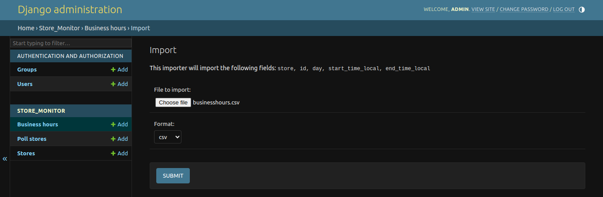
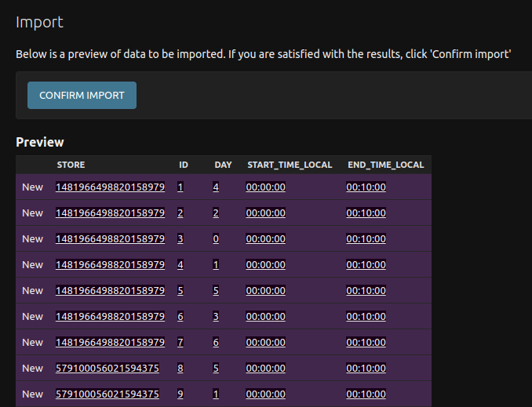
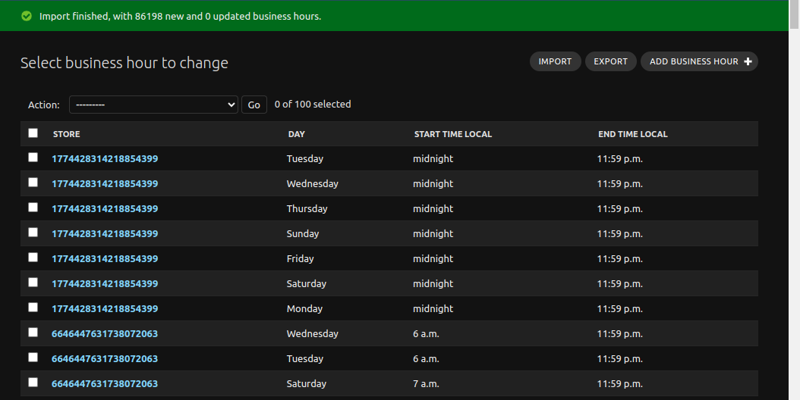
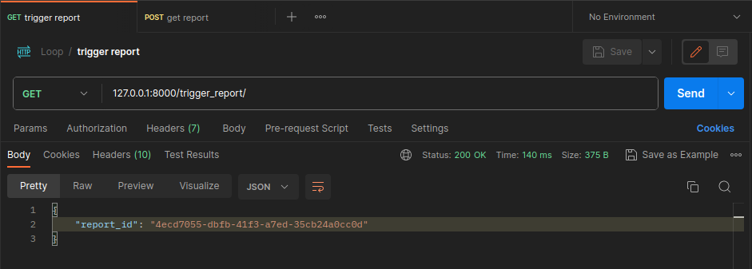
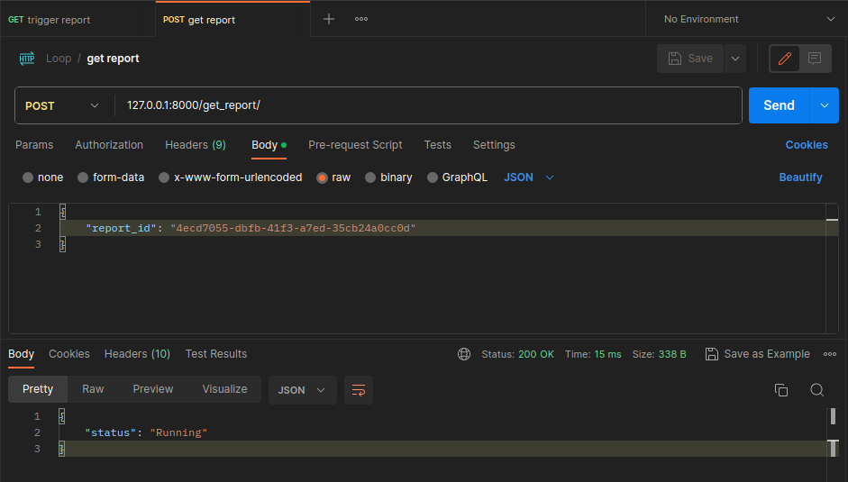
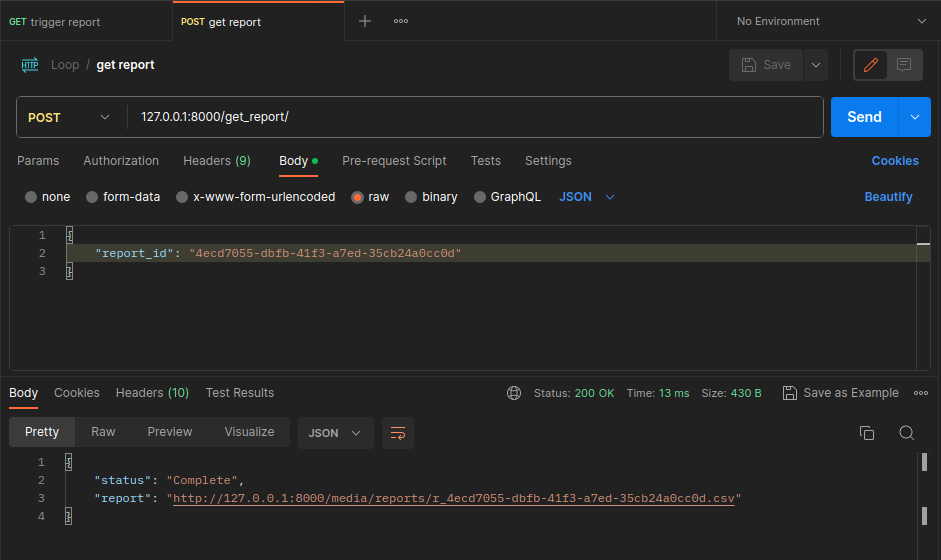
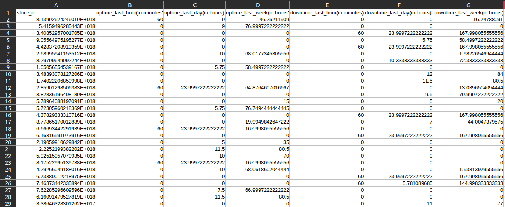

# Loop Store Monitoring System

The Loop Store Monitoring System is designed to monitor the online status of several restaurants. This backend solution allows restaurant owners to track the uptime and downtime of their stores within specified business hours.

## Table of Contents

- [Loop Store Monitoring System](#loop-store-monitoring-system)
  - [Table of Contents](#table-of-contents)
  - [Problem Statement](#problem-statement)
    - [Data Sources](#data-sources)
    - [Data Output](#data-output)
    - [API Endpoints](#api-endpoints)
  - [Technologies Used](#technologies-used)
  - [Core Implementation](#core-implementation)
  - [API and Admin Views](#api-and-admin-views)
  - [Setup and Testing](#setup-and-testing)
  - [Screenshots](#screenshots)
  - [Feedback \& Contribution](#feedback--contribution)

## Problem Statement

Loop aims to monitor various restaurants in the US, ensuring they remain online during their business hours. Occasionally, a store might go offline, prompting the need for reports on downtime frequency.

### Data Sources

We source data from three main repositories:

1. **Hourly Poll Data**: Indicates the hourly online status of each store. Schema includes `store_id, timestamp_utc, status` (filename: `store_status.csv`).
   - [CSV Data Link](https://drive.google.com/file/d/1UIx1hVJ7qt_6oQoGZgb8B3P2vd1FD025/view?usp=sharing)
2. **Business Hours Data**: Indicates the operating hours of each store. Schema includes `store_id, dayOfWeek, start_time_local, end_time_local`.
   - [CSV Data Link](https://drive.google.com/file/d/1va1X3ydSh-0Rt1hsy2QSnHRA4w57PcXg/view?usp=sharing)
3. **Timezone Data**: Provides the timezone for each store. Schema contains `store_id, timezone_str`.
   - [CSV Data Link](https://drive.google.com/file/d/101P9quxHoMZMZCVWQ5o-shonk2lgK1-o/view?usp=sharing)

### Data Output

We generate reports with the following schema:

`store_id, uptime_last_hour(in minutes), uptime_last_day(in hours), update_last_week(in hours), downtime_last_hour(in minutes), downtime_last_day(in hours), downtime_last_week(in hours)`

Uptime and downtime calculations consider only business hours.

### API Endpoints

1. **/trigger_report**:
   - Initiates report generation.
   - **Output**: report_id (random string)
2. **/get_report**:
   - Input: report_id
   - **Output**: 
     - "Running" if report is still generating
     - "Complete" with an accompanying CSV file upon completion

## Technologies Used

- Python
- Django (4.2.6) & Django Rest Framework (3.14.0)
- Celery (5.3.4)
- Redis (5.0.1)
- Pandas (2.1.1)
- Jupyter Notebook
- Docker

## Core Implementation
- `store_monitor/models.py`: Contains the database schema and related code.
- `store_status.ipynb`: Processes the `store_status.csv` data for database ingestion.
- `upload_to_db.ipynb`: Handles the uploading of `store_status.csv` to the database.

## API and Admin Views

Focus on `store_monitor/views.py` for the primary logic. Here's a breakdown:

1. **`store_monitor/admin.py`**:
    - Provides admin views for CSV uploads.
    - Useful for datasets under 100K rows due to Django's data validation which can slow the import process.
    - Admin Views:
      - 
      - 
      - 

2. **`store_monitor/views.py`**:
    - Contains the central logic to calculate and generate report.
    - Factors considered:
        - Variations in time zones.
        - Days without any store observations.
        - Days with a single observation.
        - Observations spanning multiple business hours.
        - Observations at the exact start and end of business hours.
        - Observations outside business hours.

3. **`api/views.py`**:
    - Defines API entry points.
    - Available endpoints:
      - `trigger_report/`
      - `get_report/`

To dive deeper, explore the provided codebase or refer to the in-line comments within the files.

## Setup and Testing

1. Make sure you have Docker installed.
2. Clone the repository.
3. Navigate to the main directory.
4. Run Command in terminal.
    ```bash
    docker-compose up
    ```
5. For API testing, import the `Loop.postman_collection.json` into Postman.
6. Directly use the REST API endpoints:
   - `localhost:8000/trigger_report/`
   - `localhost:8000/get_report/` with parameters:
     ```json
     {
       "report_id": "<report_id from trigger_report>"
     }
     ```
**Note**: If you encounter issues downloading the database file using the Docker compose setup:

- Comment out or remove this lines 
  ```
  chmod +x downloaddb.sh &&
  ./downloaddb.sh &&
  ``` 
  from the `docker-compose.yml` file.
- Manually download the database from [here](https://drive.google.com/file/d/1pFeXdQYQekATfYUjJcQGawBsUIeuKGjH/view?usp=sharing)


Ensure you place the downloaded file in the home directory of the repository.

## Screenshots

- Trigger Report: 
- Report Status: 
- Complete Report: 
- Resultant CSV: 

## Feedback & Contribution

Your feedback are always welcome!